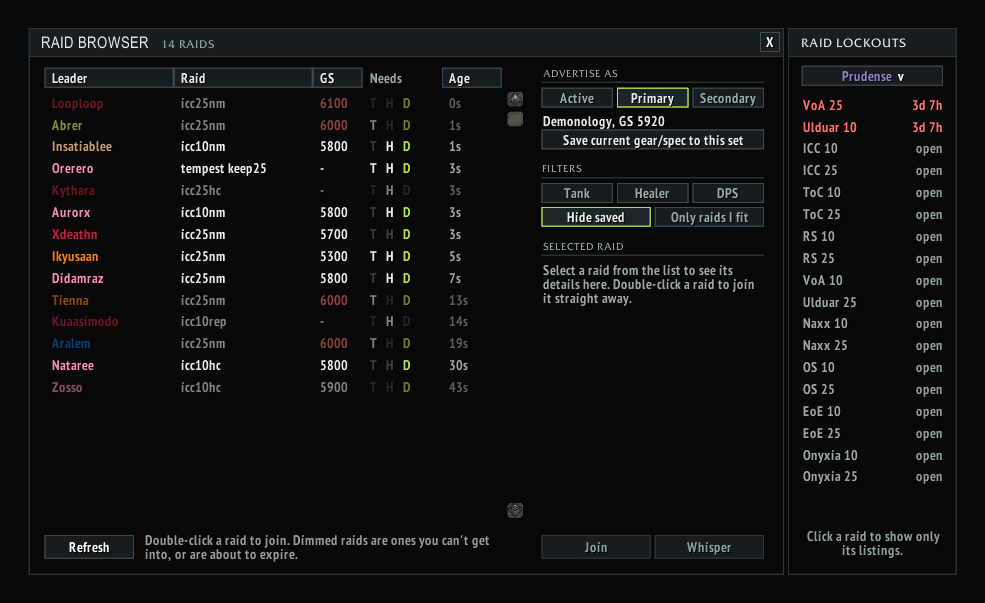

# Johnny's Raid Browser

A World of Warcraft 3.3.5a addon for the Warmane private server.

Custom window listing raids advertised via the RaidBrowser addon's LFM message feed, with role/GS filters and one-click whisper/join.

- **Raid lockouts panel** docked to the window: every WotLK raid at 10 and 25, green when available, red with time-to-reset when saved. A character picker shows your alts' lockouts too (each alt appears after you've logged into it once). No SavedInstances needed.
- **In-game update notice**: an "Update available" line appears in the window when someone running a newer version is seen, with a copyable link to the releases page.

## Screenshots

## Requirements

**Requires the [RaidBrowser](https://github.com/fjaros/RaidBrowser) addon**, which supplies the LFM feed this window displays. Open it from Johnny's Addon Hub or Johnny's Raid Comp's launcher.

## Install

1. Go to [Releases](https://github.com/JohnnyL1993/JohnnysRaidBrowser/releases) and download **`JohnnysRaidBrowser-vX.Y.zip`** from the latest release.
   Don't use GitHub's green **Code → Download ZIP** button or the "Source code" zips. Those unpack as `JohnnysRaidBrowser-main` or `JohnnysRaidBrowser-1.0`, and WoW won't load an addon whose folder name doesn't match.
2. Extract it into `World of Warcraft\Interface\AddOns\`. You should end up with `Interface\AddOns\JohnnysRaidBrowser\JohnnysRaidBrowser.toc`.
3. Restart WoW, or log out to the character screen, and make sure the addon is enabled.

## Updating

Download the latest release zip, delete the old `JohnnysRaidBrowser` folder, and extract the new one in its place.

## Other Johnny's addons

- [Johnny's Raid Comp](https://github.com/JohnnyL1993/JohnnysRaidComp)
- [Johnny's Warmane Addon Hub](https://github.com/JohnnyL1993/JohnnysAddonHub)
- [Johnny's Blacklist](https://github.com/JohnnyL1993/JohnnysBlackList)
- [Johnny's Currency Tracker](https://github.com/JohnnyL1993/JohnnysCurrencyBar)
- [Johnny's Gear Advisor](https://github.com/JohnnyL1993/JohnnysGearAdvisor)
- [Johnny's Professions](https://github.com/JohnnyL1993/JohnnysProfessions)
- [Johnny's Messenger](https://github.com/JohnnyL1993/JohnnysMessenger)
- [Johnny's Raid Roll](https://github.com/JohnnyL1993/JohnnysRaidRoll)

## Releasing (maintainer notes)

1. Bump `## Version:` in the `.toc`.
2. Commit, then `git tag vX.Y` and `git push && git push --tags`.
3. The **Release** GitHub Action builds the zip and attaches it to the release.
